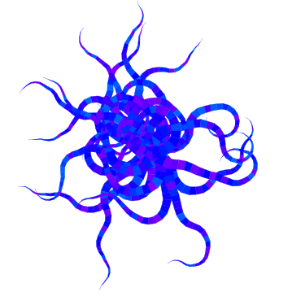

# Algoraphics

A Python library for creating graphics using algorithms and randomness.



## Installing

Python version 3.5+ is required.

```
pip install --upgrade https://github.com/daniel-munro/algoraphics/tarball/master
```

## Usage

See the (documentation)[https://algoraphics.readthedocs.io/en/latest/]
for a user guide and API.
